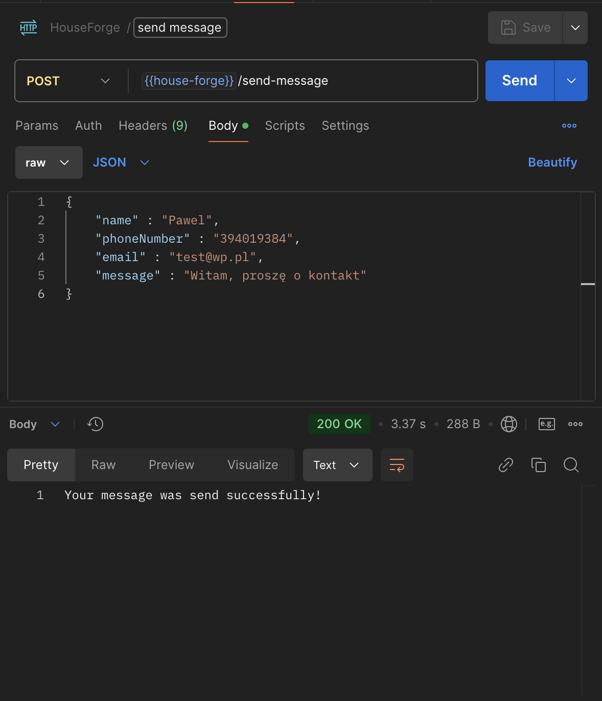

## :bookmark_tabs: About This Project

This website, built using Angular, has been created for clients looking for professionals to build their dream homes in the Tricity area. The platform allows users to explore services, check offers, and contact the company through a modern, responsive interface. Customers can reach out via the contact form for inquiries or detailed information. You can visit this site at [https://budowa-domow-trojmiasto.pl](https://budowa-domow-trojmiasto.pl).

This repository contains the **backend section** of the project, responsible for data storage, business logic, and integration with the frontend.

## :hammer_and_wrench: Used Technologies

* Java
* Spring Boot
* Spring Data JPA / Hibernate
* MySQL
* Maven
* Lombok

## :camera: Screenshots

Backend Overview
:-------------------------:

